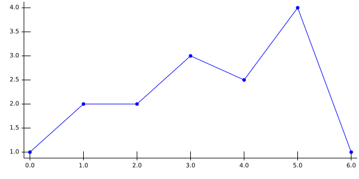

# Fund KIS' immutable React-based charts library

This is a work of [Fund KIS](http://fundkis.com/lab/react-chart) to 
easily produce quality charts.

Those graphics are produce in the [SVG](https://www.w3.org/Graphics/SVG/)
format.

More exemples are available at [the Fund KIS github page](https://fundkis.github.io/reactchart).

## Dependencies

This library is based on [React](http://facebook.github.io/react/)
and [Freezer](https://github.com/arqex/freezer).

## Usage

Let's start with a minimal example:

```
let React = require('react');
let Chart = require('reactchart');

let props = {
	width: 600, // px
    height: 300, // px
    data: [{
    	series: [{x: 0, y: 1},{x: 1, y: 2}]
    }],
    graphProps: [{color: 'blue'}]
};

class ShowChart extends React.Component {

	render(){
    	return <div>
        	<h1>My first graph!</h2>
            <Chart {...props}/>
        </div>;
    }
}

```


Then all the subtlety consists in knowing the props.

### Proprieties you should know about

The very least you need to do is to provide a _width_, a _height_,
some _data_ and _graphProps_. The data you wish to render
are the _series_ in the _data_ part, while the way you
wish to see them will be in the _graphProps_ part.

#### The _data_

The _data_ proprieties contains the numerical description of the
graphic, basically what should be shown. It is an array as one
graphic may contain several data.

```
data: [{
	series: [{x, y, value, label: {x, y}, tag}], // the data points
    type: 'Plain' or 'Bars' or ..., // type of graph
    stacked: undefined or x or y, // should the data be stacked along a direction
    coordSys: 'cart', // coordinate system,
    ord: {
    	axis: 'left' or 'right', // which axis
        type: 'number' or 'date' // type of y data
    },
    ord: {
		axis: 'bottom' or 'top',
        type: 'number' or 'date'
	}
}, ...
]
```

The first piece of information to provide is the data points. The simplest
form is ```{x, y}``` with the values being either a number or a date. The _label_ enables
to print labels instead of values at the axis' corresponding tick.

It is possible to stack values, it means that the current graphic should be on top
of the previous stacked graphics. It is only working point-wise.

The library can handle numbers and dates as input values, a date should be explicitely
declared in the correspondig proprieties (_abs_ if in abscissa or _ord_ if ordinate).

#### The _graphProps_

This contains the description of how the data should be printed. When there are
several values, the first value given is the default value.

Note that in most browser, an **undefined** color is equivalent to black.

```
graphProps: [{
	color: 'black' or 'blue' or '#1F456C' or ..., // any color
	width: 1, // any number
	fill: 'none' or 'blue' or ..., // any color or 'none'
	shade: 1, // any number between 0 and 1
    dropLine: {x: false or true, y:false or true}, // draw?
	// mark props, explicit at this level
	// overwritten if present in markProps
	// exists for friendlyness of use
	mark: true or false, // print marks ?
	markColor: undefined, // any color
	markSize: 3, // 
	markType: 'dot', //
	onlyMarks: false, //
	// contains low-level description,
	// i.e. specific things like radius
	// for a dot, or anything.
	markProps: {},
	shader: undefined, // playing with colors
	tag: {
		show: false, // show the tag
		print: (t) => t + '', // if something special needs to be done
		fontSize: 10, // any number
		pin: true or false, // show the pin
    pinColor: 'black', 
		pinLength: 10, // 10 px as pin length by default
		pinAngle: 90, // direction fo pin
    pinHook: 3
	}
}, ...
]
```
The details of the _marksProps_ are given at the [marks](https://github.com/fundkis/reactchart/#The-different-marks) section, 
the _shader_ at the [shading](https://github.com/fundkis/reactchart/#Playing-with-color) section.

##### Basic

The basic proprieties are the color (_color_), the width of the line (_width_), the opacity of
the graphic (_shade_) and wether or not the area under the curve should be colored (_fill_). Please
note that the aera filled is the one corresponding to the area between the values and the
drop values, which by default are 0. This is the mathematical definition of the integral.

##### dropLine

The _dropLine_ boolean is used to print the drop lines.

##### The marks controller at high level

A few mark controllers are available at this level of description. The most common ones:
  - should the mark be printed? _mark_;
  - the color of the marks: _markColor_;
  - the type of mark: _markType_;
  - the size of the marks: _markSize_.

The different types available are currently _dot_, _square_ and _bar_.
Note that the size has a different meaning for different marks. For more details, see the
[description of the marks](https://github.com/fundis/reactchart/#The-different-marks).

##### shader

The _shader_ enables fine color control of the marks, it has three calculations type, see
the [shading section](https://github.com/fundkis/reactchart/#Playing with color).

##### Tag the data

You can tag any data point you wish. Note that tagging is a 
[complex issue](https://en.wikipedia.org/wiki/Automatic_label_placement), and it is not
in the [FundKIS](https://fundkis.com/) TODO list to start research in this area. Thus
labelling is kept at it's most basic form: you describe a tag (called pin) with its
length, angle, and hook. The tag itself is given by a _tag_ propriety in the data point.

#### The axis' description: _axisProps_

### The different graphics' type
#### Plain
#### Bars
#### Stairs
#### Pie
### The different marks
#### Dot
#### Square
#### Bar
### Playing with the colors
### Some more playabilities (background, foreground, preprocess)
#### Histograms
### Immutability and optimisation
